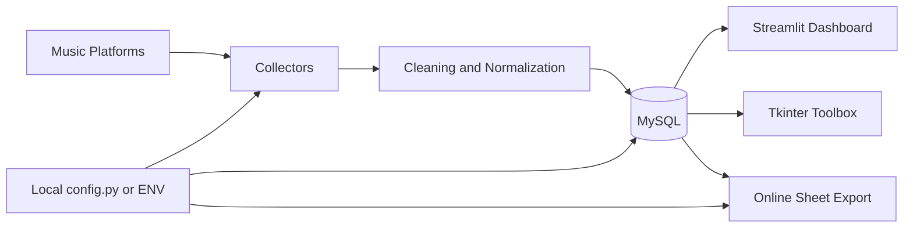

# Music Data Toolbox


Music Data Toolbox 是一个面向音乐内容运营分析场景的数据工具箱，覆盖数据采集、MySQL 入库、数据清洗、指标汇总、可视化看板和自动化更新流程。项目定位为数据分析岗位作品集，重点展示从多源数据获取到可视化洞察交付的端到端能力。

本仓库已移除真实 Cookie、Token、企业数据和内部截图，仅保留可公开展示的代码结构与示例配置。

## 项目简介

音乐内容在不同平台会产生播放量、收藏、分享、评论等多维度数据。手动收集这些数据成本高、重复性强，也很难稳定沉淀为可分析的数据资产。本项目将常见数据分析工作流封装为一套工具：

- 自动采集多平台播放趋势、互动指标和评论数据。
- 将原始数据清洗后写入 MySQL，形成可复用的数据仓库雏形。
- 使用 Streamlit 构建交互式 Dashboard，支持歌曲、平台、日期区间、评论文本和事件标注分析。
- 提供 Tkinter 桌面工具箱，降低日常更新、查看数据库和导出表格的操作成本。
- 支持将 MySQL 表数据同步到在线表格，便于非技术角色查看和协作。

## 功能介绍

### 数据采集

- 播放量趋势采集：按日期采集不同平台的播放量数据，并写入 `t_play_stat`。
- 互动量采集：采集收藏、分享、评论等互动指标，并写入 `t_song_interaction_history`。
- 评论采集：抓取评论内容、发布时间、IP/地区、用户昵称等字段，并写入 `t_comment`。
- OCR 辅助采集：对页面截图中的点赞、评论、分享数字进行 OCR 识别，补充无法直接通过接口获得的指标。
- 批量更新：通过桌面工具统一触发多个采集任务，减少重复操作。

### 数据清洗与入库

- 评论数据去重、空值处理、时间解析和字段标准化。
- 播放量按平台拆分，避免重复日期重复写入。
- 互动量支持 upsert，已有日期更新，缺失日期插入。
- 数据库配置集中管理，真实配置通过本地 `config.py` 或环境变量提供。

### Dashboard 分析

- 歌手/歌曲筛选。
- 日期区间筛选。
- 平台播放量趋势分析。
- 互动指标趋势分析。
- 评论平台分布分析。
- 评论文本检索、关键词统计和词云展示。
- 事件标注与趋势图叠加，用于观察运营动作和数据波动之间的关系。
- HTML 报告导出能力。

### 自动化工具

- `toolbox_gui_v4.1.py`：桌面端数据工具箱，整合数据库查看、数据更新、评论采集、OCR、批量任务等入口。
- `mysql_viewer_gui.py`：轻量 MySQL 表查看器。
- `mysql_table_to_feishu_sheet.py`：将 MySQL 表数据导出到在线表格。
- `streamlit_launcher.py`：一键启动 Streamlit Dashboard。

## 技术栈

| 模块 | 技术 |
| --- | --- |
| 数据采集 | Python, Requests, Selenium, DrissionPage |
| 数据处理 | Pandas, NumPy, Regex |
| 数据存储 | MySQL, PyMySQL |
| 可视化 | Streamlit, Plotly, Matplotlib, WordCloud |
| OCR | OpenCV, Pytesseract |
| 桌面工具 | Tkinter |
| 自动化与集成 | PowerShell, Batch, OAuth, Online Sheet API |
| 配置管理 | `config.example.py`, local `config.py`, environment variables |

## 系统架构



核心流程：

1. 采集脚本从平台页面/API/OCR 获取播放、互动和评论数据。
2. 清洗模块进行去重、字段转换、时间解析和异常值处理。
3. 数据写入 MySQL，形成可持续更新的分析数据集。
4. Streamlit Dashboard 从 MySQL 读取数据并生成可交互图表。
5. 桌面工具箱将常用操作封装为按钮，支持批量更新和快速查看。

## 数据库设计

项目采用接近星型模型的设计，将歌曲、平台等维度表与播放、互动、评论等事实表拆分，便于后续扩展更多平台和指标。

| 表名 | 类型 | 说明 |
| --- | --- | --- |
| `t_singer` | 维度表 | 歌手/艺人基础信息 |
| `t_song` | 维度表 | 歌曲基础信息，包含发行日期等字段 |
| `t_platform` | 维度表 | 平台字典，如不同音乐平台或统计来源 |
| `t_song_platform` | 映射表 | 歌曲在不同平台的 ID、URL 或平台编码 |
| `t_song_tme` | 映射表 | 特定平台 song id 的补充映射 |
| `t_play_stat` | 事实表 | 按歌曲、平台、日期记录播放量 |
| `t_song_interaction_history` | 事实表 | 按歌曲、平台、日期记录评论、收藏、分享等互动指标 |
| `t_comment` | 事实表 | 评论内容、发布时间、地区/IP、用户昵称等评论明细 |
| `t_event` | 维度表 | 运营事件、发布时间点、事件类型 |
| `t_event_song` | 关联表 | 事件与歌曲的多对多关系 |

推荐分析主题：

- 播放量增长趋势与平台贡献拆解。
- 收藏/分享/评论等互动指标变化。
- 评论内容关键词和用户反馈主题。
- 运营事件前后数据波动对比。
- 不同平台传播表现差异。

## Dashboard 展示

> 为避免暴露真实业务截图，仓库不包含实际 Dashboard 图片。以下为建议截图占位，上传公开演示数据后可替换为真实图片。

| 页面 | 图片占位 |
| --- | --- |
| 总览指标与趋势 | `docs/images/dashboard-overview.png` |
| 平台播放量对比 | `docs/images/platform-trend.png` |
| 评论词云与关键词 | `docs/images/comment-wordcloud.png` |
| 事件标注分析 | `docs/images/event-analysis.png` |
| 桌面工具箱 | `docs/images/toolbox-gui.png` |

示例：

```md

```

## 项目亮点

- 端到端数据链路：从采集、清洗、入库到可视化展示，覆盖完整数据分析项目流程。
- 多源数据融合：播放、互动、评论、事件数据统一进入 MySQL，支持跨平台分析。
- 自动化程度高：重复性采集任务可通过 GUI 或批处理入口触发，适合日常运营数据更新。
- Dashboard 可解释性强：趋势图、平台拆解、事件标注、评论文本分析共同支持业务洞察。
- 配置安全：真实密钥、Cookie、数据库账号不进入仓库，通过本地配置或环境变量读取。
- 可扩展性好：新增平台时主要扩展采集脚本和平台映射表，不需要重写 Dashboard 主流程。

## 如何运行

### 1. 克隆项目

```bash
git clone https://github.com/trRayy/music-toolbox.git
cd music-toolbox
```

### 2. 创建 Python 环境

```bash
python -m venv .venv
.venv\Scripts\activate
```

### 3. 安装依赖

当前仓库未强制绑定依赖版本，可以先按功能安装常用依赖：

```bash
pip install pandas numpy pymysql requests streamlit plotly matplotlib pillow jieba wordcloud selenium webdriver-manager opencv-python pytesseract DrissionPage
```

如只运行 Dashboard，可优先安装：

```bash
pip install pandas pymysql streamlit plotly matplotlib pillow jieba wordcloud
```

### 4. 配置本地参数

复制示例配置：

```bash
copy config.example.py config.py
```

在 `config.py` 中填写本地 MySQL、Cookie、Token、OCR 路径等信息。`config.py` 已被 `.gitignore` 忽略，不应提交到 GitHub。

也可以使用环境变量覆盖配置，例如：

```powershell
$env:MYSQL_HOST="localhost"
$env:MYSQL_PORT="3306"
$env:MYSQL_USER="music_user"
$env:MYSQL_PASSWORD="your_password"
$env:MYSQL_DB="music_db"
```

### 5. 准备 MySQL 数据库

根据上方数据库设计创建对应表结构，并写入基础维度数据：

- 歌手和歌曲基础信息。
- 平台字典。
- 歌曲与平台 ID/URL 的映射。
- 可选的事件标注数据。

### 6. 启动 Dashboard

```bash
streamlit run music_dashboard63.py
```

也可以使用启动器：

```bash
python streamlit_launcher.py
```

### 7. 启动桌面工具箱

```bash
python toolbox_gui_v4.1.py
```

Windows 用户也可以双击：

```text
tool启动 V4 .1.bat
```

### 8. 常用命令示例

采集播放趋势：

```bash
python tme_crawler.py
```

采集评论数据：

```bash
python wangyiyun_comment.py --song YOUR_SONG_ID --song-id 1 --cookie "YOUR_COOKIE"
```

导出 MySQL 表到在线表格：

```powershell
.\import_music_data_to_feishu.ps1 -Table t_play_stat -SheetUrl "https://example.feishu.cn/sheets/YOUR_SPREADSHEET_TOKEN"
```

## 安全说明

- 不要提交 `config.py`、`.env`、Cookie、Token、日志、截图和真实业务数据。
- 已提交过的密钥即使从当前版本删除，也仍可能存在于 Git 历史中，应立即轮换。
- Dashboard 示例截图建议使用脱敏数据或模拟数据生成。
- 如果要公开演示，请使用单独的 demo 数据库，不要连接生产数据库。

## 后续规划

- 增加 `requirements.txt` 或 `pyproject.toml`，固定依赖版本。
- 提供 MySQL 建表 SQL 和最小 demo 数据集。
- 增加 Docker Compose，一键启动 MySQL 与 Dashboard。
- 增加采集任务调度能力，如定时任务、失败重试和日志归档。
- 增加数据质量校验，如重复记录、缺失日期、异常峰值检测。
- 增加更多 Dashboard 页面，如平台转化漏斗、评论情感分析、事件影响评估。
- 增加单元测试和 CI，保证采集、清洗、入库逻辑稳定。

## 作品集说明

这个项目适合作为数据分析岗位作品集，展示以下能力：

- Python 数据采集与自动化脚本开发。
- MySQL 数据建模和指标沉淀。
- Pandas 数据清洗和标准化处理。
- Streamlit/Plotly 数据可视化交付。
- 自动化工具封装和跨角色协作意识。
- 开源安全与配置脱敏意识。
